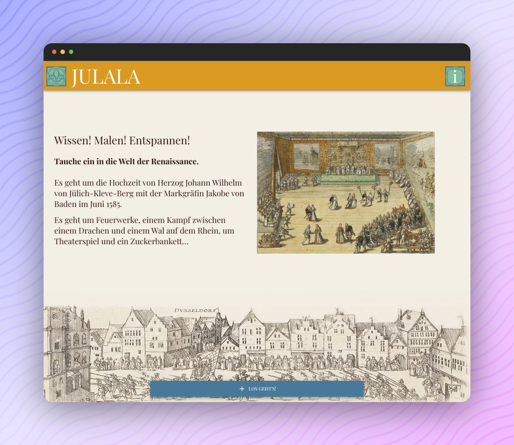

<p align="center">
  <a href="https://digitalwarenkombinat.github.io/julala/">
    
  </a>
</p>

---

[](https://digitalwarenkombinat.github.io/julala/)

## About [_Julala_](https://digitalwarenkombinat.github.io/julala/)

The project **Julala** has been created during the Coding da Vinci Nieder.Rhein.Land 2021 cultural hackathon as a further development of the [**Plantala**](https://github.com/digitalwarenkombinat/plantala) project realized during the Coding da Vinci Niedersachsen 2020 cultural hackathon.   

The web project offers the opportunity to generate, print and color mandalas from vectorized copperplate elements. 

The copperplate elements belong to the collection “Fürstlich Jülich´sche Hochzeit” ("Royal Jülich Wedding") from the workshop of Franz Hogenberg and show the events surrounding the wedding of Duke Johann Wilhelm of Jülich-Kleve-Berg and Margravine Jakobe of Baden in June 1585. 

_As part of the Coding da Vinci Nieder.Rhein.Land 2021 cultural hackathon, the Düsseldorf City Museum has provided the object data sets for the “Fürstlich Jülich´sche Hochzeit” (license CC BY 4.0 Stadtmuseum Düsseldorf)._

_All vector graphics and Julalas created for the project were provided with a CC BY-SA 4.0 license._

_The source code of Plantala/Julala runs under an MIT license._  
  
### MaaS (Media station as a Service)

Furthermore within the project developed the idea of **Media station as a Service (MaaS)**, which allows easily to reuse the framework of the **Plantala** and **Julala** projects to create new, simple Mandala generators and to use them as media station for example in museums, galleries or educational centers.

## [Create your own media station!](./medienstationAsAService/README.md)

## Feedback

Feel free to send us feedback on [Twitter](https://twitter.com/digiwako) or [file an issue](https://github.com/digitalwarenkombinat/julala/issues/new). Feature requests are always welcome.

## Getting started

Run the following command on your local environment:

```
git clone --depth=1 https://github.com/digitalwarenkombinat/julala.git
cd julala
npm install
```

You can run the application in development mode with live reload:

```
npm run dev
```

Open http://localhost:3000 with your favorite browser to see the application.

```
.
├── README.md            # README file
├── next.config.js       # Next JS configuration
├── public               # Public folder
│   └── images           # Images used by the application
├── components
│   ├── ui               # Visual components
│   └── utils            # Utility folder
├── pages                # Next JS pages
└── tsconfig.json        # TypeScript configuration
```

You can see the results locally in production mode with:

```
npm run build
npm run start
```

The generated HTML and CSS files are minified (built-in feature from Next js).
